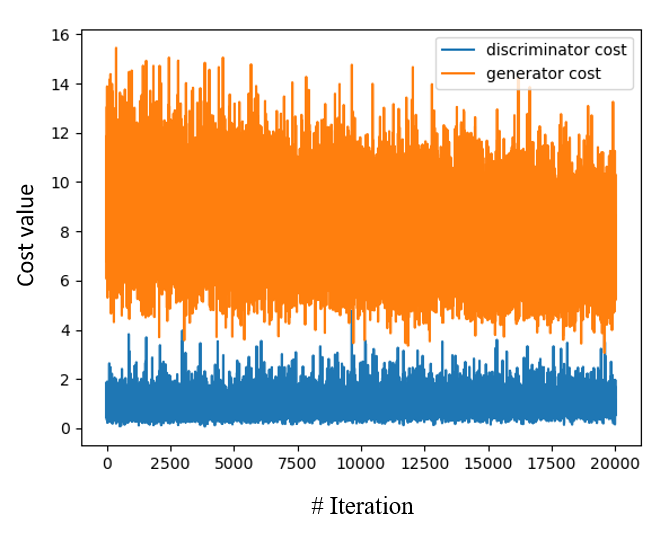

This project is based on the following article: 
"Image-to-Image Translation with Conditional Adversarial Networks" - (https://arxiv.org/pdf/1611.07004.pdf)

the original data can be found here: https://www.kaggle.com/datasets/vikramtiwari/pix2pix-dataset

The project implementing the article example of edges --> shoes example based on Tensorflow library.
## cost Vs. Iteration

## From Train set: 

## From Test set: 

